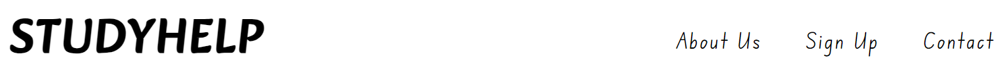
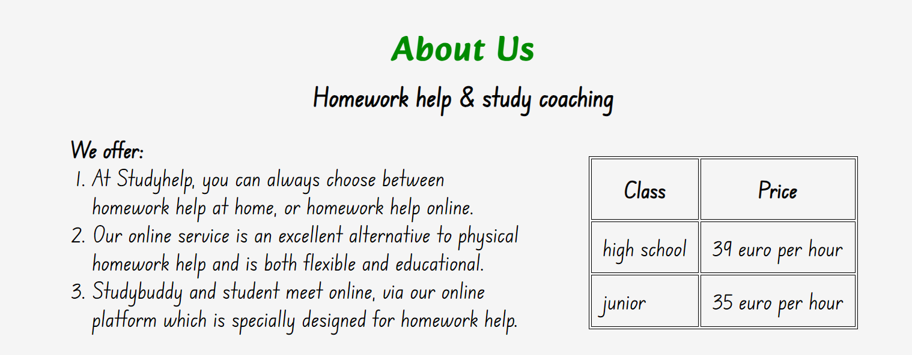
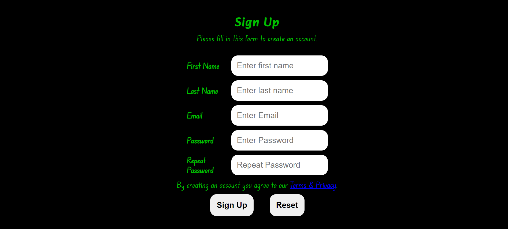

# Studyhelp:

StudyHelp and it is a company with paid services that is targeted to students with different age groups and levels. Its purpose is to make it easier for students that are facing difficulties and struggles in their studies and need extra help. 
The website uses three colours black, green and white which creates easy to read text while still giving enough contrast with background to be read by users. Users of this website will be able to find all the information they need to know about StudyHelp: services, prices, contact information and a signup form. 

## Features 

- __Navigation Bar__

  - Featured at the top of the page, the naviagation shows the company name in the left corner: STUDYHELP that links to the top of the page.
  - The other navigation links are to the right: About us, Signup and Contact us which links to different sections of information easy to find.
  - The navigation clearly tells the user the name of the company and website and makes the different sections of information easy to find.

- __The header__
  - The header shows the name of the company using the white color for text overlay.
  - The section helps the user to understand the service that Studyhelp provides.

- __About us section__

  - The About us section details about what Studyhelp offers their members and has a table with the pricing of sevices.
  - This section shows the user the important information they need to know about Studyhelp: What they offer and the service is available for both junior and high school levels.

- __Sign up section__

  - The sign up section has a form to collect details so the user can sign up to Studyhelp.  
  - The form collects the user's first and last name, an email adress and creates a password.
  - The sign up form is valuable to the user as it gives them the ability to sign up to join Studyhelp.The sign up form has two buttons a Signup button and a Reset button.

- __Contact us section__ 

  - The contact section encourages users to get in contact and provides a phone number, email adress and street adress where they can be found. 
  - The contact section includes social media icons so users can find Studyhelp on facebook, twitter and instagram.
  - Thee contact section is valuable to the user as it gives them the ability to find and contact Studyhelp if they need to.

## Testing 
- I tested that this page works in different browsers: Chrome, Firefox, Safari.
- I confirm that this project is responsive, looks good and functions on all standard screen sizes using the devtools device toolbar.
- I confirmed that the navigation, header,abou us sign up and contact text are all readable and easy to understand.
- I have confirmed that the form works: requires entries in every field, will only accept an email in the email field and the sign up and reset works with no issues.

### bugs

**solved bugs**

- The homepage was refreshing every 10 seconds and that made the form wipes the inputs before the user can submit. And the was because of the meta refresh redirect. I moved it from the index.html file to the signup.html file. 

- At first i used float in my project and it gave me a bad positioning when using it and the content in every section was not aligned and put the way i intended to. Understanding and using flexbox made it a lot easier and gave me more flexibility.. 

**Unfixed Bugs**

- no bugs unfixed 

### Validator Testing 

- HTML
  - No errors were returned when passing through the official [W3C validator](https://validator.w3.org/nu/?doc=https%3A%2F%2Fprogrammer-1991.github.io%2FPP1-StudyHelp%2Findex.html)
- CSS
  - No errors were found when passing through the official [(Jigsaw) validator](https://jigsaw.w3.org/css-validator/validator?uri=https%3A%2F%2Fprogrammer-1991.github.io%2FPP1-StudyHelp%2Findex.html&profile=css3svg&usermedium=all&warning=1&vextwarning=&lang=sv)
  - test with light house
- Accessibility
  - I confirmed that the colors and fonts chosen are easy to read and accessible by runnig it through lighthouse in devtools
  

## Deployment

- The site was deployed to GitHub pages. The steps to deploy are as follows: 
  - In the GitHub repository, navigate to the Settings tab 
  - From the source section drop-down menu, select the Master Branch
  - Once the master branch has been selected, the page will be automatically refreshed with a detailed ribbon display to indicate the successful deployment. 

The live link can be found here - [STUDDYHELP](https://programmer-1991.github.io/PP1-StudyHelp/) 

## Credits

### Content 

- The icons in the footer were taken from [Font Awesome](https://fontawesome.com/)
- The code to make social media links was taken from the [love running](https://github.com/Code-Institute-Org/love-running-2.0) Project.

### Media

- The image in the header is taken from [Pexels](https://www.pexels.com/)